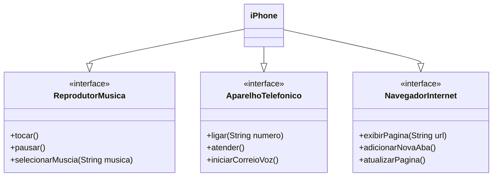

# Desafio de Programação - Modelagem e Diagramação de um Componente iPhone

Este repositório contém a solução para o desafio de modelar e diagramar o componente iPhone com base nas funcionalidades descritas.

## Contexto

O desafio foi proposto como parte da trilha Java Básico da DIO e se baseia no vídeo de lançamento do iPhone em 2007. O objetivo é criar um diagrama UML para representar as funcionalidades do iPhone como:

* **Reprodutor Musical**
* **Aparelho Telefônico**
* **Navegador na Internet**

E, posteriormente, essas implementar essas classes e interfaces em Java.

## Funcionalidades a Modelar

### Reprodutor Musical

* **Métodos:**
  * `tocar()`
  * `pausar()`
  * `selecionarMusica(String musica)`

### Aparelho Telefônico

* **Métodos:**
  * `ligar(String numero)`
  * `atender()`
  * `iniciarCorreioVoz()`

### Navegador na Internet

* **Métodos:**
  * `exibirPagina(String url)`
  * `adicionarNovaAba()`
  * `atualizarPagina()`

## Diagrama UML

Abaixo está o diagrama UML que representa a modelagem do componente iPhone. Ele foi criado utilizando a sintaxe Mermaid.

